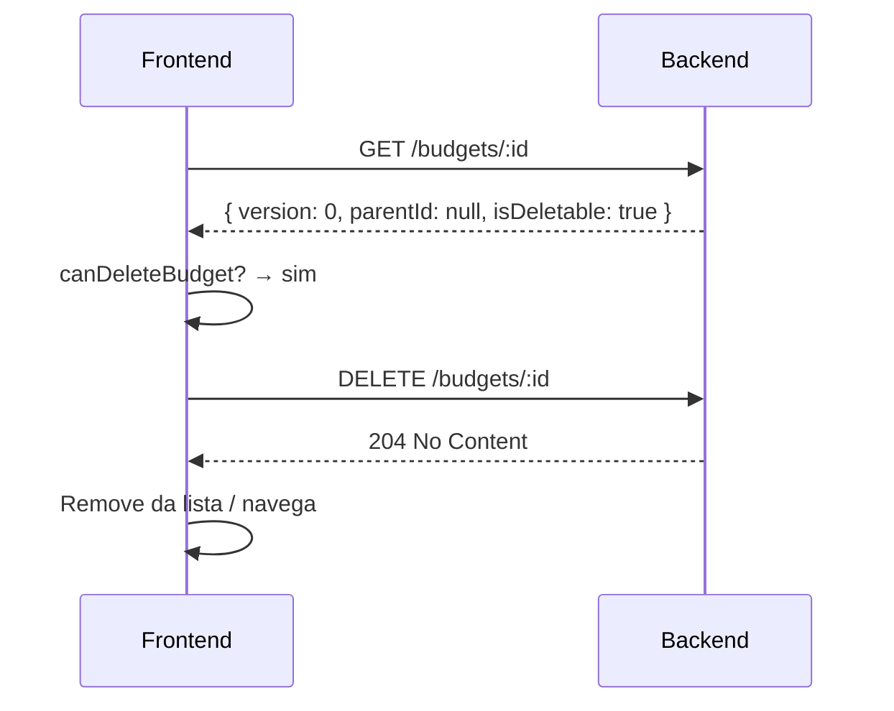
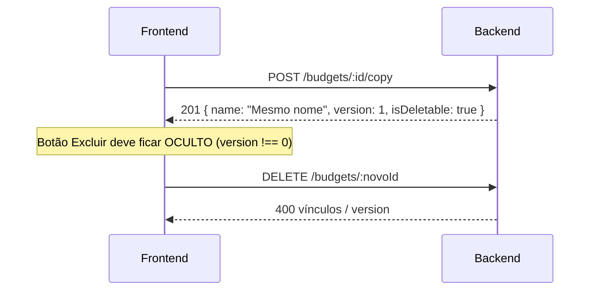

# Integração — Excluir orçamento, versionamento e nome na cópia

Guia para integrar no frontend as alterações recentes do backend:

- **`DELETE /budgets/:id`** com regras de vínculo
- Campo **`isDeletable`** nas listagens e no detalhe
- **`version` inicia em `0`** (orçamento raiz recém-criado)
- **Nome na primeira aprovação** sem sufixo `v1` (cópias oficiais)
- Comportamento de **duplicar (`POST /copy`)** em relação a nome e versão

> **Base URL:** `http://localhost:10000` (ou `PORT` do ambiente)  
> **Swagger:** `GET /api/docs`  
> **Autenticação:** JWT em `Authorization: Bearer <token>`  
> **Documentação relacionada:**  
> - [integracao-status-orcamento-frontend.md](./integracao-status-orcamento-frontend.md) — `status`, `isEditable`, `parentId`, aprovação  
> - [integracao-duplicar-orcamento.md](./integracao-duplicar-orcamento.md) — fluxo completo de duplicar

---

## 1. Resumo das mudanças

| Mudança | Impacto no frontend |
|---------|---------------------|
| `DELETE /budgets/:id` | Nova ação **Excluir** com confirmação e tratamento de erro |
| `isDeletable` | Flag read-only para habilitar/desabilitar botão de excluir |
| `version` padrão `0` | Orçamento novo criado com `version: 0` (não mais `1`) |
| Nome na aprovação | 1ª versão aprovada mantém o **nome base**; a partir da 2ª, `"<base> vN"` |
| Duplicar (`/copy`) | Nome **igual** ao original; cópia nasce com `version: 1` e **não** pode ser excluída pela API atual |

---

## 2. Excluir orçamento

### 2.1 Endpoint

```http
DELETE /budgets/:id
Authorization: Bearer <token>
```

| Parâmetro | Onde | Obrigatório | Descrição |
|-----------|------|-------------|-----------|
| `id` | path | sim | UUID do orçamento |

**Body:** nenhum.

### 2.2 Respostas

| HTTP | Corpo | Quando |
|------|-------|--------|
| `204 No Content` | vazio | Exclusão concluída |
| `400 Bad Request` | `{ "error": "mensagem" }` | Regra de negócio ou ID inválido |
| `401 Unauthorized` | — | Token ausente ou inválido |

Mensagens comuns:

- `Orçamento não encontrado`
- `Não é possível deletar pois há mais orçamentos vinculados a ele`
- `Dados inválidos`

> A exclusão **não** verifica `isEditable`. Orçamentos somente leitura (`status` 2 ou 4) podem ser removidos **desde que** passem nas regras abaixo.

### 2.3 Regras de negócio

Um orçamento só é excluído quando **todas** as condições são verdadeiras:

| Condição | Motivo |
|----------|--------|
| `version === 0` | Raiz “virgem” — sem versão derivada na família |
| `parentId === null` | Não é cópia oficial de aprovação |
| Sem filhos | Nenhum outro orçamento com `parentId` apontando para este `id` |

```typescript
// Regra equivalente no cliente (fonte de verdade para habilitar o botão)
function canDeleteBudget(budget: BudgetApi): boolean {
  return budget.version === 0 && budget.parentId === null && budget.isDeletable;
}
```

#### O que **não** pode ser excluído

| Cenário | `version` | `parentId` | Filhos | Resultado |
|---------|-----------|------------|--------|-----------|
| Orçamento raiz após 1ª aprovação | `0` | `null` | sim | Bloqueado (`isDeletable: false`) |
| Cópia oficial (aprovada/produção) | `≥ 1` | raiz | — | Bloqueado |
| Duplicata via `POST /copy` | `1` | `null` | — | Bloqueado (`version !== 0`) |
| Orçamento raiz sem aprovações | `0` | `null` | não | **Permitido** |

#### Efeito colateral no banco

Por `ON DELETE CASCADE`, ao excluir um orçamento permitido:

- Linhas em `tb_budget_lines` do orçamento são removidas
- Vínculo em `tb_folders_budgets` é removido

Orçamentos filhos **não** são excluídos em cascata (FK `parent_id` é `SET NULL`); por isso a API impede delete quando existem filhos.

### 2.4 Serviço HTTP sugerido

```typescript
export async function deleteBudget(id: string, token: string): Promise<void> {
  const res = await fetch(`${API_URL}/budgets/${id}`, {
    method: "DELETE",
    headers: { Authorization: `Bearer ${token}` },
  });

  if (!res.ok) {
    const body = await res.json().catch(() => ({}));
    throw new Error(body.error ?? "Falha ao excluir orçamento");
  }
}
```

### 2.5 UX sugerida

| Elemento | Sugestão |
|----------|----------|
| Onde mostrar | Menu do card, detalhe do orçamento, lista da pasta |
| Visibilidade | `canDeleteBudget(budget)` — **não** usar só `isDeletable` |
| Label | **Excluir** |
| Confirmação | Modal: “Esta ação não pode ser desfeita.” |
| Pós-sucesso | Toast + remover item da lista ou redirecionar para a pasta |
| Erro `400` | Exibir `error` do corpo; mensagem genérica se vínculos existirem |

---

## 3. Campo `isDeletable`

Disponível em:

- `GET /budgets` (lista)
- `GET /budgets/:id` (item)
- `GET /budgets/:id/details` (detalhe com linhas)

```typescript
interface BudgetApi {
  // ... demais campos
  isDeletable: boolean;
}
```

### 3.1 Como o backend calcula

```sql
NOT EXISTS (
  SELECT 1 FROM tb_budgets child
  WHERE child.parent_id = budget.id
)
```

Ou seja: `isDeletable === true` quando **não há orçamentos filhos** (cópias de aprovação apontando para este `id`).

### 3.2 Atenção: `isDeletable` ≠ permissão total de delete

| Campo / regra | O que indica |
|---------------|--------------|
| `isDeletable` | Sem filhos na família |
| `version === 0` | Raiz sem versão numerada |
| `parentId === null` | Não é derivado de aprovação |

**Exemplo de armadilha:** duplicata via `POST /copy` retorna `isDeletable: true` (sem filhos), mas `version: 1` impede o `DELETE`. Use `canDeleteBudget()` da seção 2.3.

---

## 4. Versionamento (`version` a partir de `0`)

### 4.1 Valores por origem

| Origem | `version` | `parentId` | Pode excluir? |
|--------|-----------|------------|---------------|
| `POST /budgets` (novo) | `0` | `null` | Sim, se sem filhos |
| `POST /budgets/:id/copy` (duplicar) | `1` | `null` | **Não** |
| `PATCH /budgets/:id/approve` (cópias) | `nextVersion` (≥ 1) | `rootBudgetId` | **Não** |

> Documentos anteriores citavam `version: 1` na criação. O backend atual usa **`version: 0`** como default em `Budget.create`.

### 4.2 Impacto na UI

- Badge **v0** ou ocultar versão quando `version === 0` (produto decide).
- Agrupamento por família continua com `rootBudgetId = parentId ?? id`.
- Após aprovar, o orçamento **original** permanece com `version: 0`; as cópias recebem `version: 1`, `2`, …

---

## 5. Nome ao criar cópias

Há dois fluxos distintos. Não confundir **Duplicar** com **Aprovar**.

### 5.1 Duplicar — `POST /budgets/:id/copy`

| Campo | Comportamento |
|-------|---------------|
| `name` | **Igual** ao orçamento origem |
| `status` | Igual ao origem |
| `version` | Fixo `1` |
| `parentId` | `null` (família nova) |

O backend **não** incrementa `v2`, `v3`, … no duplicar. Se a UI precisar distinguir cópias paralelas, renomeie no cliente após o `201`:

```typescript
function suggestCopyName(originalName: string): string {
  const base = originalName.replace(/\s+v\d+$/i, "").trim();
  return `${base} (cópia)`;
}

// Após POST /copy, se isEditable:
await updateBudget(newId, { name: suggestCopyName(source.name) });
```

Ver [integracao-duplicar-orcamento.md](./integracao-duplicar-orcamento.md) para o fluxo completo.

### 5.2 Aprovar — `PATCH /budgets/:id/approve` (alteração recente)

Regra de nome versionado (cópias **oficiais** na mesma família):

```typescript
function getApprovedCopyName(baseName: string, nextVersion: number): string {
  const base = baseName.replace(/\s+v\d+$/i, "").trim();
  return nextVersion > 1 ? `${base} v${nextVersion}` : base;
}
```

| `nextVersion` | Nome resultante (base `"Orçamento Evento"`) |
|---------------|---------------------------------------------|
| `1` | `"Orçamento Evento"` *(sem sufixo `v1`)* |
| `2` | `"Orçamento Evento v2"` |
| `3` | `"Orçamento Evento v3"` |

Antes desta mudança, a 1ª aprovação já gerava `"Orçamento Evento v1"`. Ajuste labels e testes do frontend se dependiam do sufixo na primeira versão.

---

## 6. Modelo atualizado na API

```typescript
interface BudgetListItemApi {
  id: string;
  name: string;
  customerId: string;
  folderId: string;
  taxNf: number;
  status: BudgetStatus;
  isEditable: boolean;
  isDeletable: boolean;   // NOVO
  parentId: string | null;
  version: number;          // 0 para raiz novo; ≥ 1 para cópias
  createdBy?: string;
  updatedBy?: string | null;
  createdAt: string;
  updatedAt?: string;
  jobDescription?: string;
  location?: string;
  eventDate?: string;
  paymentTerm?: PaymentTerm;
}

interface BudgetDetailApi extends BudgetListItemApi {
  customerName: string;
  folderName: string;
  lines: BudgetLineDetailApi[];
}
```

`GET /budgets/:id` passou a retornar o mesmo shape enriquecido da lista (`BudgetListItemApi`), não mais o modelo interno mínimo.

---

## 7. Fluxos resumidos

### 7.1 Excluir orçamento raiz



### 7.2 Duplicar × excluir



---

## 8. Matriz de ações por tipo de orçamento

| Tipo | Como identificar | Duplicar | Aprovar | Excluir |
|------|------------------|----------|---------|---------|
| Rascunho raiz | `version: 0`, `parentId: null`, `status: 1` | Sim | Sim | Sim (se `isDeletable`) |
| Raiz em produção | `version: 0`, `status: 3` | Sim | Sim | Não (após 1ª aprovação, tem filhos) |
| Cópia paralela (copy) | `version: 1`, `parentId: null` | Sim | Depende do `status` | **Não** |
| Snapshot aprovado | `parentId` preenchido, `status: 2 ou 4` | Sim | Não | **Não** |
| Produção derivada | `parentId` preenchido, `status: 3` | Sim | Sim | **Não** |

---

## 9. Checklist de implementação no frontend

- [ ] Adicionar `isDeletable` ao tipo `BudgetApi` / store.
- [ ] Implementar `canDeleteBudget()` com `version === 0 && !parentId && isDeletable`.
- [ ] Botão **Excluir** + modal de confirmação chamando `DELETE /budgets/:id`.
- [ ] Tratar `204` (sem body) e `400` com `{ error }`.
- [ ] Atualizar expectativa de `version: 0` em orçamentos recém-criados (`POST /budgets`).
- [ ] Ajustar exibição de versão na 1ª aprovação (sem `v1` no nome).
- [ ] Manter duplicar com nome igual; renomear no cliente se necessário (`PUT /budgets/:id`).
- [ ] Não confundir excluir com bulk delete de linhas (`PUT /budget-lines/bulk` campo `delete`).

---

## 10. Teste manual rápido

```bash
TOKEN="<jwt>"
BASE="http://localhost:10000"

# 1. Criar orçamento (version deve ser 0)
CREATE=$(curl -s -X POST "$BASE/budgets" \
  -H "Authorization: Bearer $TOKEN" \
  -H "Content-Type: application/json" \
  -d '{"name":"Teste Delete","customerId":"<UUID>","folderId":"<UUID>"}')
ID=$(echo "$CREATE" | jq -r '.id')
echo "$CREATE" | jq '{id, name, version, isDeletable}'

# 2. Excluir (deve retornar 204)
curl -s -o /dev/null -w "%{http_code}\n" -X DELETE "$BASE/budgets/$ID" \
  -H "Authorization: Bearer $TOKEN"

# 3. Duplicar e tentar excluir cópia (deve retornar 400)
COPY=$(curl -s -X POST "$BASE/budgets/<UUID_ORIGEM>/copy" \
  -H "Authorization: Bearer $TOKEN")
COPY_ID=$(echo "$COPY" | jq -r '.id')
echo "$COPY" | jq '{id, name, version, isDeletable}'

curl -s -X DELETE "$BASE/budgets/$COPY_ID" \
  -H "Authorization: Bearer $TOKEN" | jq
```

---

## 11. FAQ

**Posso excluir uma duplicata (`POST /copy`)?**  
Não. A cópia nasce com `version: 1`. Apenas raízes com `version: 0` e sem vínculos podem ser removidas.

**`isDeletable: true` mas o DELETE falha — é bug?**  
Não necessariamente. Verifique `version` e `parentId`. Use `canDeleteBudget()`.

**Excluir remove as versões aprovadas da família?**  
Não chega a isso: se existem filhos (`parentId` apontando para o raiz), o delete é bloqueado antes.

**Duplicar muda o nome para `v2`?**  
Não. Só a **aprovação** aplica sufixo `vN` (a partir da 2ª versão). Duplicar mantém o nome original.

**Preciso atualizar [integracao-status-orcamento-frontend.md](./integracao-status-orcamento-frontend.md)?**  
Sim, onde ainda constar `version: 1` na criação ou nome `v1` na primeira aprovação — este documento reflete o comportamento atual.

---

## 12. Referência no código backend

| Artefato | Caminho |
|----------|---------|
| Delete use case | `src/application/budgets/usecases/budget/delete/delete-budget.usecase.ts` |
| Copy use case | `src/application/budgets/usecases/budget/copy/copy-budget.usecase.ts` |
| Approve (nome versionado) | `src/application/budgets/usecases/budget/approve/approve-budget.usecase.ts` |
| `isDeletable` / listagem | `src/infra/database/repositories/budget/budget.repository.ts` |
| Controller | `src/api/controllers/budgets.controller.ts` |
| Default `version: 0` | `src/domain/budgets/entities/budget.entity.ts` |
